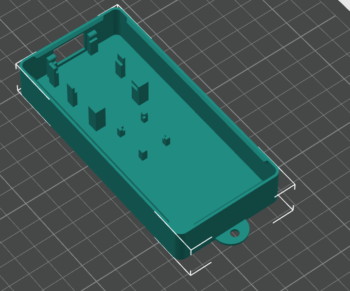
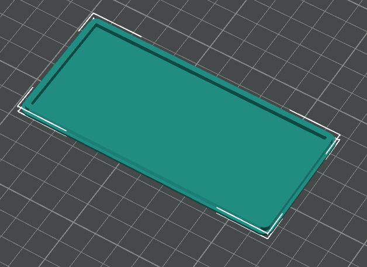
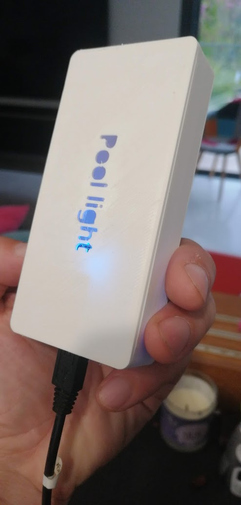

# ESPHome remote for SeaMAID lighting projector

## Features

+ Turn on / off the light
+ Change the lightning mode

## Hardware

+ D1 mini ESP8266
+ stx882 (433Mhz transmitter)

Connect:
+ D1 ground to stx ground
+ D1 5V to stx VIN
+ D1 D4 (GPI02) to stx DATA

## Software

Create a new ESPHome with the following code: [pool-light.yaml](pool-light.yaml) 

## Case

### Box

[pool-light-box.stl](pool-light-box.stl)

In the box, the big mount is for the ESP and the small for the stx.

### Top

[pool-light-top.stl](pool-light-top.stl)

### Photo

